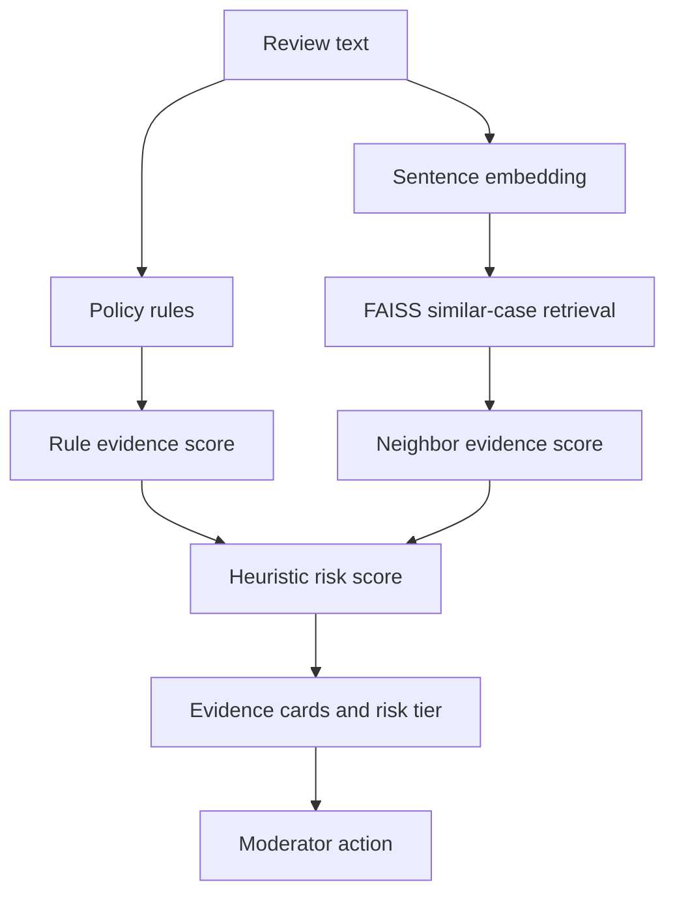

# 🛡️ Verdict AI

**An explainable review-moderation and human-review workflow prototype**

Verdict AI combines deterministic policy rules with semantic similar-case retrieval to help moderators inspect potentially problematic reviews. Instead of presenting a black-box prediction, the interface shows the policy signals, matched text patterns, related examples, and a heuristic risk tier behind each result.

> **Prototype scope:** Verdict AI is a decision-support demo, not a production moderation service. Its scores are heuristic evidence scores—not calibrated probabilities, accuracy estimates, or final policy judgments.

## 🎯 Live Prototype

[Open the Streamlit prototype](https://ai-review-moderation-2-hdqedtqcmlbagcmiewmebt.streamlit.app)

The deployed prototype demonstrates the implemented analysis workflow. Some queue, analytics, historical-outcome, and moderator metadata are synthetic and are included only to demonstrate the intended product experience.

## ✨ What the Prototype Demonstrates

- **Auditable policy rules:** category-specific keywords, phrases, regex patterns, and weights stored in YAML
- **Matched policy signals:** visible keyword and regex evidence, including URLs, email addresses, phone numbers, and other configured patterns
- **Semantic similar-case retrieval:** SentenceTransformer embeddings and FAISS nearest-neighbor search
- **Evidence-based risk presentation:** Low, Medium, and High heuristic risk tiers
- **Explainable results:** triggered rules, matched phrases, detected patterns, and retrieved examples
- **Human-review workflow prototype:** a demo queue with Flag, Escalate, Approve, and Retry actions
- **Degraded operation:** the interface can continue with rule evidence when semantic retrieval is unavailable, although fallback scoring remains prototype-level

## 🏛️ System Architecture



The primary Streamlit application runs the rule engine and semantic retriever directly. It does not require an LLM to generate its main moderation result.

## 🧮 How Scoring Works

### Rule evidence

Each policy category has a configured heuristic weight in `app/rules.yml`. A matching keyword or regex pattern activates that rule's weight. Activated rule scores are added and capped at `1.0`.

Regex matches can be treated as strong evidence by the Streamlit prototype. For example, a detected phone number or email address can strengthen a matching policy signal.

### Neighbor evidence

The semantic retriever:

1. Converts the submitted review into an embedding using `sentence-transformers/all-MiniLM-L6-v2`.
2. Uses FAISS inner-product search over normalized reference embeddings.
3. Retrieves the five closest reviews by default.
4. Averages their raw similarity values.
5. Maps that average to a bounded `0–1` neighbor evidence score.

The neighbor score measures similarity to the available reference corpus. It does **not** independently mean that a review has a particular probability of violating policy, and it does not necessarily measure similarity to confirmed flagged reviews.

### Final risk presentation

Rule and neighbor evidence are combined using prototype heuristics. The default configuration gives rule evidence more influence than neighbor evidence. The resulting value is mapped to:

| Risk tier | Prototype threshold |
|---|---:|
| High | `≥ 0.70` |
| Medium | `≥ 0.40` and `< 0.70` |
| Low | `< 0.40` |

These thresholds and weights have not been statistically calibrated. The displayed score must not be interpreted as confidence, model accuracy, or the probability that a review violates policy.

## 🧩 Policy Categories

The YAML rule set contains prototype signals for all nine report-reason categories:

| ID | Policy category | Human-review designation in the rule engine |
|---:|---|---|
| 1 | Wrong Community | Yes |
| 2 | Off-topic / Irrelevant | No |
| 3 | False Information | Yes |
| 4 | Affiliated with Community | Yes |
| 5 | Competitor / Ex-employee | Yes |
| 6 | Toxic / Hate / Lewd | No |
| 7 | Privacy / PII | No |
| 8 | Promotion / Advertising | No |
| 9 | COVID-related content | No |

This table describes the current code configuration, not validated category performance. Some categories—such as false information, affiliation, identity, or misinformation—cannot be reliably verified from review text alone and require human judgment or additional evidence.

## 🔍 Explainability and Moderator Experience

For each analyzed review, the interface can show:

- Overall heuristic risk tier and score
- Matched policy categories
- Rule weights
- Matched keywords and phrases
- Detected regex patterns
- Semantic neighbor evidence
- Retrieved review text
- Recommended human-review status

The Queue tab demonstrates the intended review workflow. Moderator actions currently update Streamlit session state only; they are not persisted to a database or external case-management system.

Historical decisions, risk labels, analytics, and queue records shown in the interface include synthetic demo metadata. Retrieved review text is selected through semantic search, but the displayed historical outcome is not guaranteed to be the actual moderation outcome of that retrieved record.

## 🧠 Lexicon Exploration

The notebooks include an experimental workflow for:

- N-gram candidate extraction
- Class-conditional frequency comparison
- Log-odds-based phrase ranking
- Manual inspection of candidate lexicons

Generated candidates are research artifacts. They are **not automatically promoted** into the runtime rule set; production rules still require manual review and inclusion in `app/rules.yml`.

## 🔧 Tech Stack

| Area | Technology |
|---|---|
| Application UI | Streamlit |
| Core logic | Python |
| Rules and lexicons | YAML, keywords, regex |
| Sentence embeddings | SentenceTransformers (`all-MiniLM-L6-v2`) |
| Vector retrieval | FAISS |
| Data exploration | pandas, scikit-learn, Jupyter |
| Experimental API | FastAPI |
| Experimental LLM path | OpenAI API |

No Dify, Coze, LangChain, LangGraph, CrewAI, or AutoGen framework is used in this repository.

## 🗂️ Project Structure

```text
.
├── app/
│   ├── decision.py              # Policy matching and heuristic scoring
│   ├── neighbor.py              # SentenceTransformer + FAISS retrieval
│   └── rules.yml                # Runtime policy rules and weights
├── backend/
│   ├── app.py                   # Experimental FastAPI endpoint
│   ├── classifier.py            # Experimental retrieval + LLM classifier
│   └── retriever.py             # Experimental backend retriever
├── frontend/
│   └── streamlit_app.py         # Alternate API-based frontend
├── data/
│   ├── samples/
│   │   └── sample_reviews.csv   # Small reference corpus used by the demo
│   ├── labeled/                 # Experimental labeled artifacts
│   └── debug/                   # Data-quality debugging artifacts
├── docs/
│   ├── PRD.md
│   └── model_card.md
├── notebooks/
│   ├── 01_exploratory_iteration.ipynb
│   ├── 02_data_cleaning.ipynb
│   └── 03_generate_rules_keywords.ipynb
├── streamlit_app.py             # Primary Verdict AI prototype
└── requirements.txt
```

## 🚀 Run Locally

### 1. Create and activate a virtual environment

```bash
python -m venv .venv
source .venv/bin/activate
```

On Windows:

```powershell
.venv\Scripts\activate
```

### 2. Install dependencies

```bash
pip install -r requirements.txt
```

### 3. Start the primary prototype

```bash
streamlit run streamlit_app.py
```

## 📥 Reference Data

The primary semantic retriever expects a CSV containing:

```text
review_text,vote_reason_id
```

By default, it can use:

```text
data/samples/sample_reviews.csv
```

An alternate corpus path can be supplied through the `DATA_PATH` environment variable. If a usable corpus or embedding model is unavailable, the interface catches the retrieval error and continues with rule evidence.

## 🧪 Experimental RAG/LLM Backend

The `backend/` directory contains a separate experimental path that retrieves related cases and includes them in an OpenAI prompt. This is a RAG-style classification experiment, but it is **not connected to the primary root-level Streamlit application** and its required backend index artifacts are not included.

Accordingly, Verdict AI's current primary demo should be described as:

> **Rules + semantic similar-case retrieval**

rather than as a complete production RAG or agent system.

## 📊 Evaluation Status

No validated accuracy, precision, recall, F1, latency, or retrieval-quality result is claimed in this repository.

`docs/PRD.md` and `docs/model_card.md` describe intended evaluation criteria and future targets. A credible evaluation would require:

- A representative, independently labeled test set
- Clearly defined ground-truth policy outcomes
- Category-level precision and recall
- False-positive and false-negative analysis
- Retrieval relevance evaluation
- Threshold calibration
- Moderator workflow and time-on-task testing

## 🔐 Data and Privacy Notice

The sample corpus is intended for demonstration. The repository also contains labeled and debugging artifacts derived during experimentation, including identifiers and review text. Their authorization and redistribution status should be reviewed before the repository or its data is reused, shared, or deployed.

For a public or production release:

- Retain only authorized synthetic or public data
- Remove restricted data from both the current repository and Git history
- Exclude private datasets through `.gitignore`
- Avoid logging submitted review text or personal information
- Apply access control and retention policies

## ⚠️ Current Limitations

- Rule weights, score blending, and thresholds are heuristic
- Scores are not calibrated probabilities
- Semantic similarity is not equivalent to policy violation likelihood
- Some rules may overlap and activate more than one category
- Keyword rules can miss new wording or produce false positives
- The queue and analytics experience uses synthetic demo data
- Moderator actions are not persisted
- No authentication, authorization, audit log, rate limiting, or production monitoring is implemented
- The experimental backend is incomplete and separate from the primary demo

## 🛠️ Production Work Required

Before production use, the system would need:

- Authorized and versioned training/evaluation data
- Validated scoring and calibrated thresholds
- Persistent case storage and moderation audit logs
- Authentication and role-based authorization
- Queue assignment, prioritization, and escalation policies
- Moderator feedback and appeal workflows
- Bias, privacy, security, and abuse testing
- Monitoring for retrieval quality, drift, latency, and failures
- Clear policy ownership and rule-change governance

## 🏁 Project Status

| Component | Status |
|---|---|
| YAML rule engine | Implemented prototype |
| Keyword and regex evidence | Implemented prototype |
| SentenceTransformer + FAISS retrieval | Implemented prototype |
| Explainability interface | Implemented prototype |
| Moderator queue and actions | Demo only |
| Lexicon mining | Experimental notebook workflow |
| RAG/LLM backend | Experimental and not connected to the primary app |
| Statistical performance validation | Not completed |
| Production moderation infrastructure | Not implemented |

Verdict AI is best understood as a functional portfolio prototype exploring how transparent policy evidence and similar-case retrieval can support—not replace—human moderation decisions.
